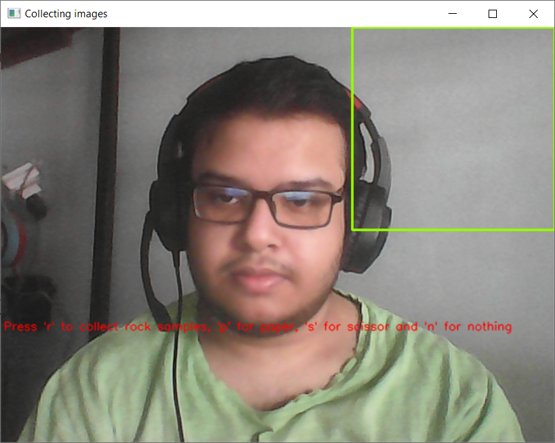
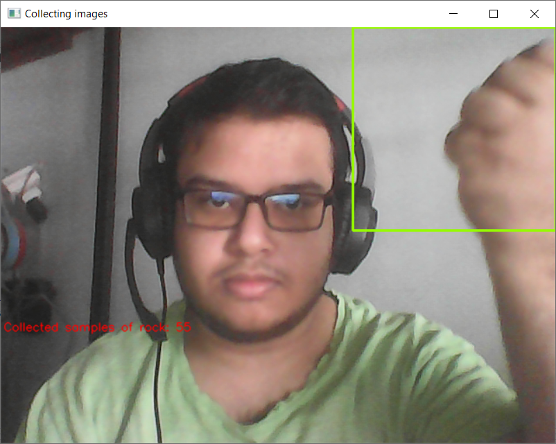
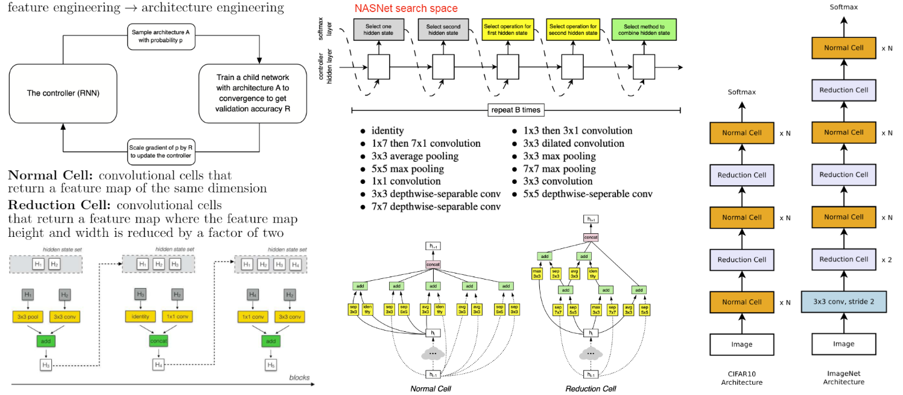
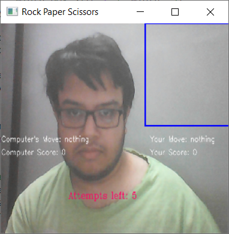
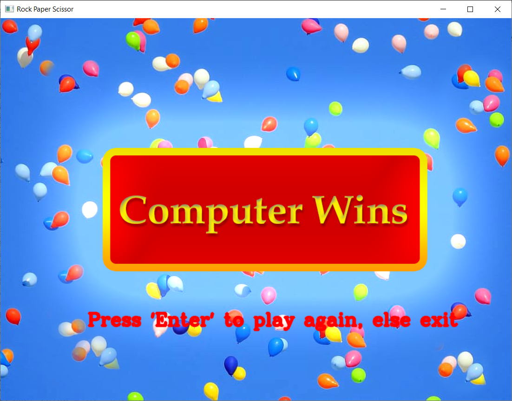

  <h1 align="center">ROCK, PAPER, SCISSORS GAME AI USING TENSORFLOW AND OPENCV</h1>

  
Table of Contents

  <ol>
    <li>
      <a href="#about-the-project">About The Project</a>
      <ul>
        <li><a href="#built-with">Built With</a></li>
      </ul>
    </li>
    <li><a href="#gathering-and-pre-processing-the-data">Gathering And Pre-Processing The Data</a></li>
    <li><a href="#nasnet-mobile-model">NASNet-Mobile Model</a></li>
    <li><a href="#usage">Usage</a></li>
    <li><a href="#future-updates">Future Updates</a></li>
    <li><a href="#resources">Resources</a></li>
    <li><a href="#license">License</a></li>
  </ol>

## About The Project

I was bored so I decided to make an RPS game but with an AI instead. I’ve Fine-tuned  NASNETMobile model to recognize my hand signs when it’s inside the box. When the model predicts my hand signs, the AI randomly generates its own move. And then the winner of that move is decided.

### Built With

This section lists any major technologies that I built this project using. Here are a few examples.
* Python
* Tensorflow
* OpenCV
* NASnet Mobile

## Gathering And Pre-Processing The Data

The basis of any Deep Learning model is DATA. Any Machine Learning Engineer would agree that in ML the data is far more crucial than the algorithm itself. I need to collect images for the symbols Rock, Paper and Scissor. Instead of downloading somebody else’s data and training on it, I made my own dataset.

The gather_data function is used to collect 100 samples for each class by placing our hands in the ROI box of size 224 x 224.

  

  

I combined all the images and labels in a single list and then preprocess them as required by the network. After preprocessing is done I will split them into train and test sets.

## NASnet-Mobile Model

Transfer learning takes a pre-trained model and does not include its final layers that make the final prediction thereby leaving us with the powerful part of the model that can distinguish features in images for this case and pass this information to our own Dense Neural Network.

  

NAS is an algorithm that searches for the best neural network architecture. Most of the algorithms work in this following way. Start off by defining a set of “building blocks” that can possibly be used for our network. In the NAS algorithm, a controller Recurrent Neural Network (RNN) samples these building blocks, putting them together to create some kind of end-to-end architecture. This architecture generally embodies the same style as state-of-the-art networks, such as ResNets or DenseNets, but uses a much different combination and configuration of the blocks. This new network architecture is then trained to convergence to obtain some accuracy on a held-out validation set. The resulting accuracies are used to update the controller so that the controller will generate better architectures over time, perhaps by selecting better blocks or making better connections. The controller weights are updated with policy gradient. The whole end-to-end setup is shown below.

  

I loaded up NASNETMobile without the head, because it was trained on 1000 imagenet classes and I have to predict just 4 classes so I don’t need the head of the model. I have just put a single dense layer with 712 units. I’ve also added a dropout Layer, and Global Average Pooling to avoid overfitting.

_For more details, please refer to the [Documentation](https://github.com/maziarraissi/Applied-Deep-Learning/blob/main/01%20-%20Computer%20Vision/01%20-%20Image%20Classification/03%20-%20AutoML.pdf)_

## Usage

Run the final script where I put it all together. Put your hands inside the box and start playing.

  

  

## Future Updates

1. Hand detection so we don't need to explicitly draw a target zone and model would first detect hand position then make a prediction.
2. Try out other models.
3. Work with a larger dataset for far more accurate results.

## Resources

* https://en.wikipedia.org/wiki/Neural_architecture_search
* https://www.tensorflow.org/api_docs
* https://towardsdatascience.com/everything-you-need-to-know-about-automl-and-neural-architecture-search-8db1863682bf
* https://github.com/HOD101s/RockPaperScissor-AI-
* https://github.com/maziarraissi/Applied-Deep-Learning
* https://github.com/spmallick/learnopencv/tree/master/Playing-rock-paper-scissors-with-AI
* https://docs.opencv.org/

## LICENSE

Distributed under the MIT License. See `LICENSE` for more information.

